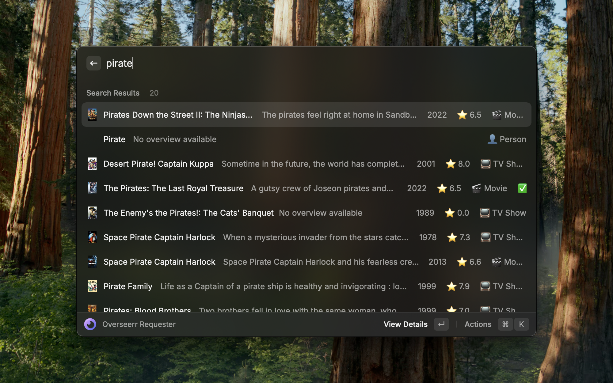
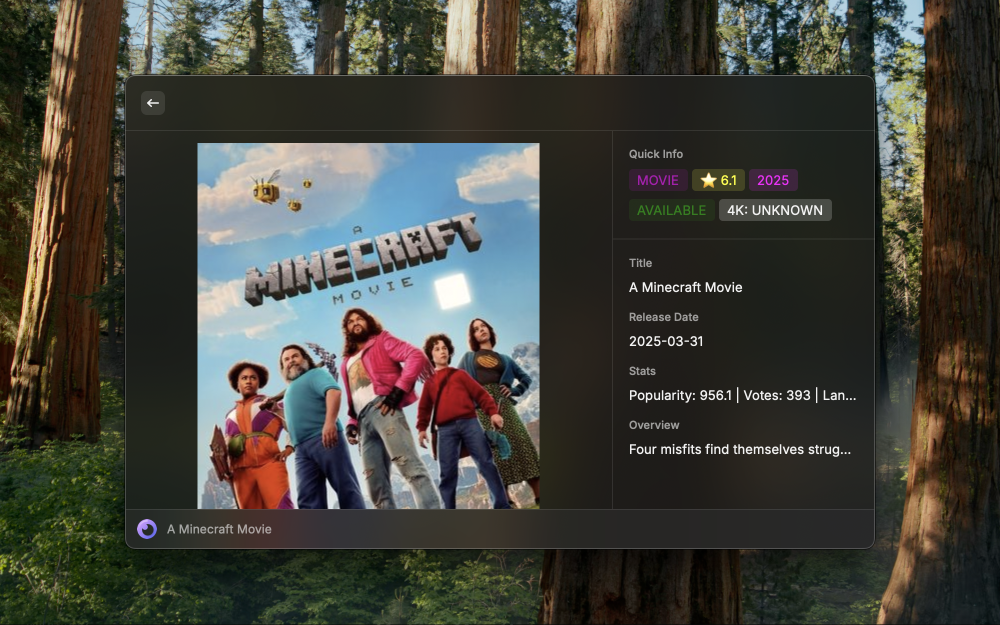
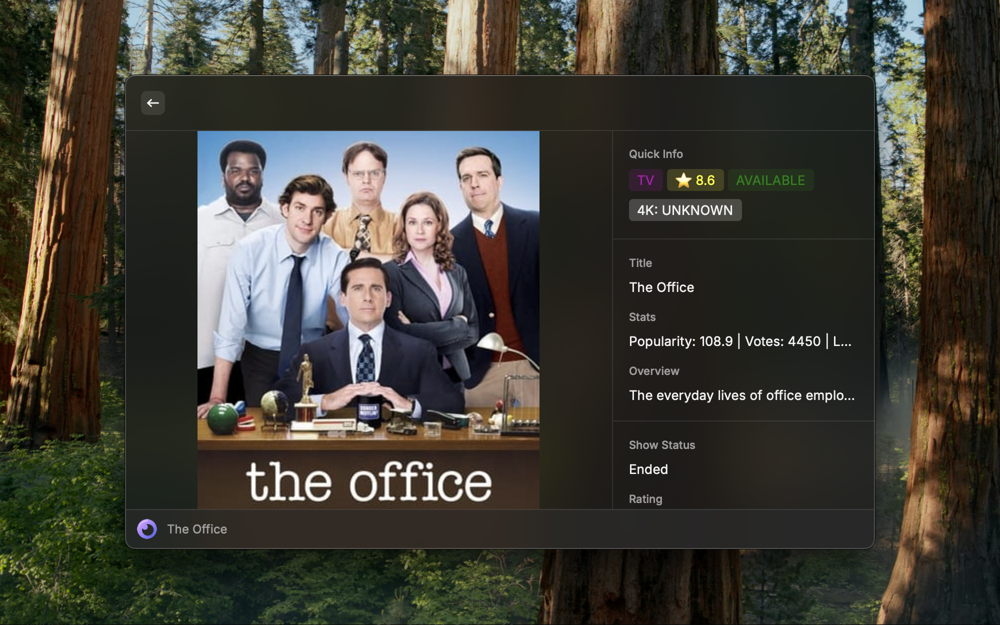
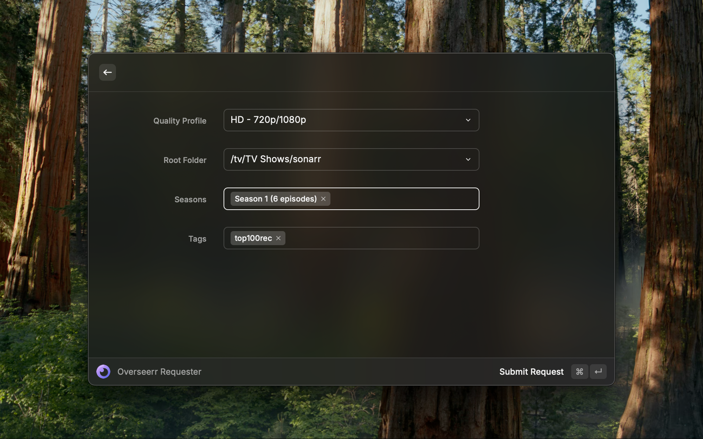
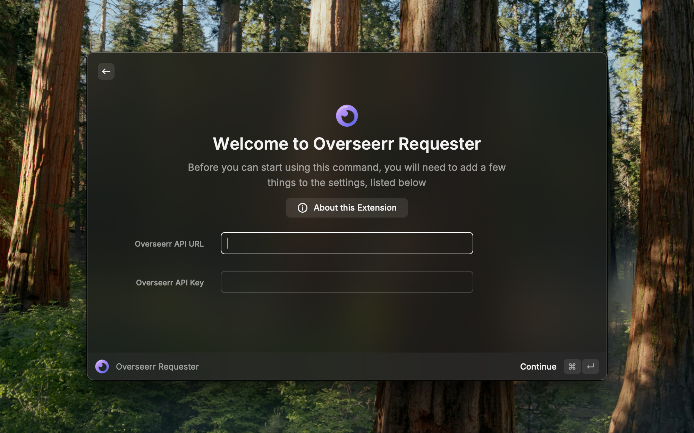

# Raycast Overseerr Requesterr

A Raycast extension for requesting media through Overseerr.

take a overseerr API key and URL and allows for searching for movies and tv shows. Checks download status and allows for making requests. Expects Overseerr integration with Radarr and Sonarr instances.

Future features to add:
- give movie/show page a open in imdb action
- add integration for plex info to open in plex
- add integration to open external radarr/sonarr link
- add editing request options
- look into adding plex integration to add to watchlist

### Additional possible steps
If your setup is comparable to mine, then you have overseerr running through docker behind a domain through npm. In which case CORS might not be enabled for your overseerr api endpoint by default. I had to put this into the advanced tab for the proxy to enable CORS:
```
location / {
    proxy_pass {YOUR_IP_HERE}:{OVERSEERR_PORT};  # replace with your actual internal Docker IP or service name and port
    proxy_set_header Host $host;
    proxy_set_header X-Real-IP $remote_addr;
    proxy_set_header X-Forwarded-For $proxy_add_x_forwarded_for;
    proxy_set_header X-Forwarded-Proto $scheme;
    proxy_set_header X-Api-Key $http_x_api_key;

    # CORS headers
    add_header 'Access-Control-Allow-Origin' '*' always;
    add_header 'Access-Control-Allow-Methods' 'GET, POST, OPTIONS, PUT, DELETE' always;
    add_header 'Access-Control-Allow-Headers' 'Origin, Content-Type, Accept, Authorization' always;
    add_header 'Access-Control-Allow-Credentials' 'true' always;

    # Preflight
    if ($request_method = OPTIONS) {
        add_header 'Access-Control-Max-Age' 1728000;
        add_header 'Content-Type' 'text/plain; charset=UTF-8';
        add_header 'Content-Length' 0;
        return 204;
    }
}
```
## Screenshots

Here's a visual walkthrough of the extension in action:


*Search for movies and TV shows directly from Raycast*


*View detailed information about movies and TV shows*


*Check download and availability status*


*Make requests with customizable options pulled from radarr/sonarr instance through overseerr api*


*Configure your Overseerr connection settings*


